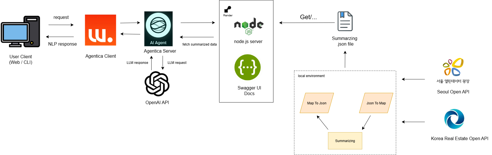

# 📊 장사하기 좋은날 챗봇

소상공인을 위한 **상권 분석 기반 창업 의사결정 지원 챗봇**  
사용자가 자연어로 질문하면, 실제 상권 데이터를 기반으로 **유리/보통/불리** 판정을 내려주고, 상세한 상권 분석 정보를 제공합니다.

 

# 팀원 구성

| **박재민** | **유재환** | **이상윤** | **이제원** | **차기원** | **전우진** |
| :------: |  :------: | :------: | :------: | :------: | :------: |
| [   @JMespoir](https://github.com/JMespoir) | [   @letsgojh](https://github.com/letsgojh) | [  ] | [   @cozymob](https://github.com/cozymob) |[   @cha9572](https://github.com/journey-ji) |

 

## 프로젝트 개요
- **프로젝트명**: 장사하기 좋은날 챗봇 (Good Day to Start Business Chatbot)
- **목적**: 소상공인이 창업 전 상권을 손쉽게 분석하고 창업 타당성을 빠르게 판단할 수 있도록 지원
- **핵심 기능**
  - 지역별 유동인구, 점포 수, 임대료 등 상권 지표 분석
  - 업종별 맞춤형 가중치 로직으로 창업 유리/불리 판정
  - GPT 기반 자연어 인터페이스 제공
  - 서울시 공공데이터 API 및 OpenAI API 연동

 

 

## 주요기능
- 상권 검색 : "강남구 역삼동 역삼역 1번출구에 카페 업종으로 창업하면 괜찮을까?" -> 상권 분석 결과 제공
- 데이터 기반 분석 : 경쟁 점포 수, 유동인구, 임대료, 추정매출 지표
- AI 응답 : GPT를 활용한 자연어 질의응답
- 업종 특화 분석 : 음식 서비스, 패스트푸드점, 교육시설, 의료보건, 판매 업종 등 대분류된 10개의 업종에 대해 제공된 정보를 바탕으로 특화된 데이터 분석

 

 

## 시스템 아키텍처

 

 

## 프로젝트 구조 -> 디렉토리 구조

 

 

## 기여 가이드

### Git Convention
- **Commit Message 규칙**
  - `feat`: 새로운 기능 추가  
  - `fix`: 버그 수정  
  - `docs`: 문서 수정  
  - `style`: 코드 스타일 변경 (포맷팅, 세미콜론 등)  
  - `refactor`: 코드 리팩토링  
  - `test`: 테스트 코드 관련 작업  
  - `chore`: 빌드 업무, 패키지 매니저 설정 등

- 예시 :

    feat: 유저 로그인 API 추가
    fix: 회원가입 시 이메일 중복 체크 오류 수정
    docs: README 설치 방법 업데이트

---
### Branch 전략
- **main**: 배포 가능한 안정적인 코드만 머지  
- **develop**: 개발 브랜치, 기능 단위 브랜치들을 여기서 통합  
- **feature/**: 새로운 기능 개발 (`feature/login`, `feature/chat`)  
- **fix/**: 버그 수정 (`fix/login-error`)

- 예시 :
└── develop
├── feature/login
├── feature/chat
└── fix/auth-bug

--- 

### Pull Request 규칙
1. PR 제목은 **작업 내용 요약** (예: `feat: 채팅 UI 추가`)  
2. 최소 **1명 이상 리뷰 승인** 후 머지

 

 

## 기술 스택
- **Frontend** : React(Vite)
- **Backend** : Node.js, Express
- **AI/LLM** : OpenAi GPT API, Agentica
- **Infra** : Render
- **Docs** : Swagger, JSDoc
- **Collaboration** : Discord, Notion, Github, Git

 

 

## 역할 분담

 

 

## 개발 시작 날짜

- 시작 날짜 : 2025-08-03 ~

 

 

## 설치 및 실행방법

 

1. .env 변수 설정

client와 server 그리고 node-server 디렉토리에 각각 .env파일을 생성 후 아래 변수를 설정합니다.

client/.env
    OPENAI_API_KEY=OPEN AI Platform에서 발급받은 API KEY
    VITE_AGENTICA_WS_URL=ws://localhost:3000/chat

server/.env
    OPENAI_API_KEY=OPEN AI Platform에서발급받은 API KEY
    PORT=agentica 서버를 실행 포트번호

node-server/.env
    AUTHENTICATION_KEY=서울시 열린광장에서 발급받은 API KEY
    PORT=node 서버를 실행 포트번호

2. Agentica client 서버 실행 (프론트)

    cd client
    pnpm install
    pnpm start

3. Node 백엔드 서버 실행

    cd node-server
    npm install
    npm run build //dist/ 생성
    npm start //지정한 port에서 서버 가동

4. Agentica 서버 실행

    cd agentica-server
    pnpm install
    pnpm build
    pnpm start

5. chatbot 사용

브라우저에서 다음 주소로 접속 : 

    http://localhost:5173 #또는 client 실행 시 지정한 포트
    
이후 챗봇에게 양식에 맞는 요청을 입력하면 됩니다.
⚠️ 질문이 지정된 form과 어긋날 경우 응답이 거절될 수 있습니다.

 

 

## 참고 프로젝트
- [Agentica](https://github.com/wrtnlabs/agentica)
    오픈소스 LLM 에이전트 프레임워크.
    본 프로젝트는 Agentica의 **LLM 함수 호출 설계 및 클라이언트-서버 구조**를 참고하여 구현되었습니다.

 

## 사용 예시

-> 사진 넣기

## 비즈니스 로직 
